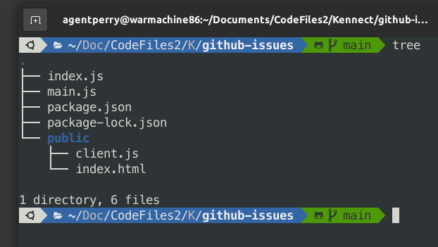

# github-issues-finder

## Use

1. It can be used to calculate weekly closure rate of issues of any github repository.
2. It covers all edge cases and can handle all types of errors
3. You can try it out on the heroku link deployed [https://github-issues-finder.herokuapp.com/](https://github-issues-finder.herokuapp.com/).

## Technology

1. npm package Octokit has been used to fetch from github repository
2. NodeJS server and frontend has been done using bootstrap

## Filesystem

